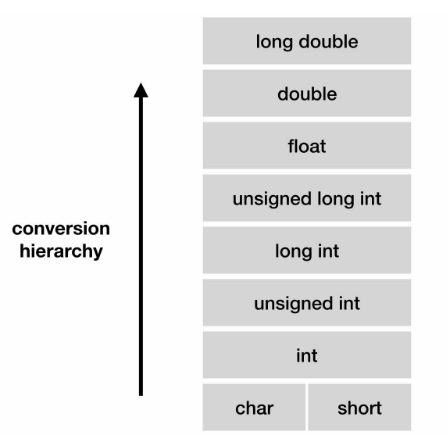
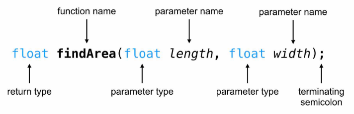
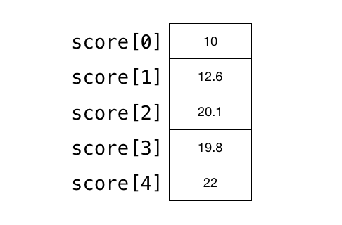
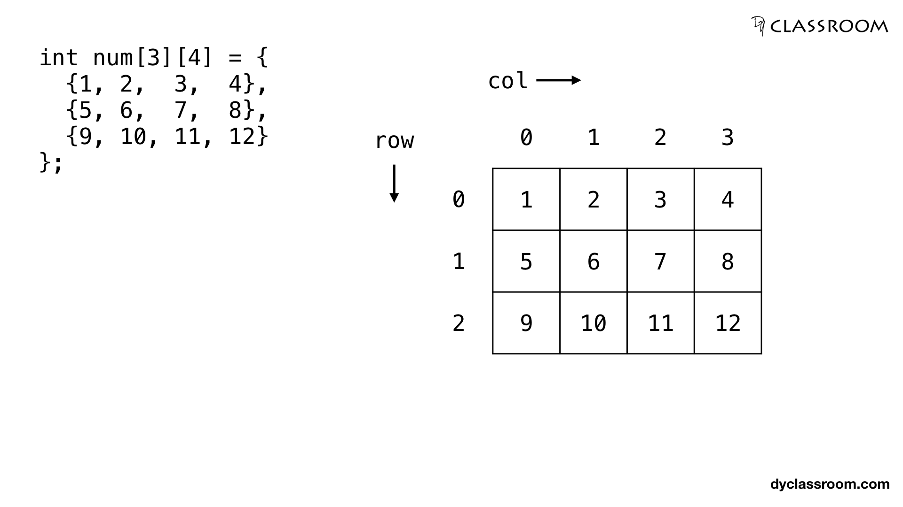
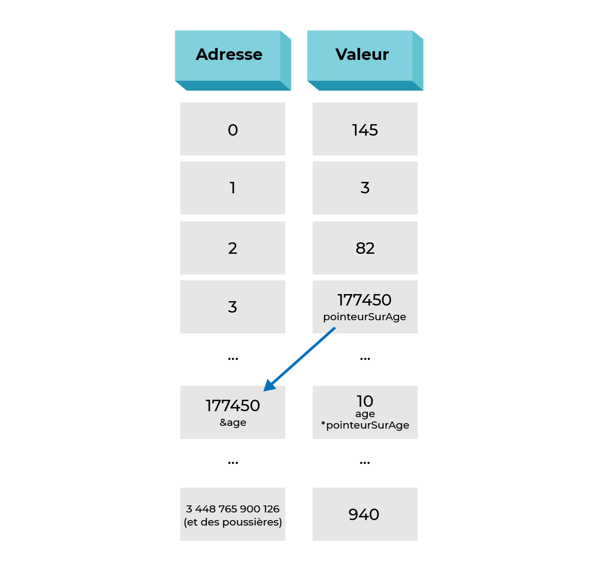
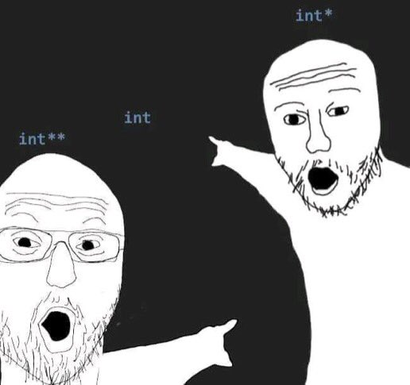
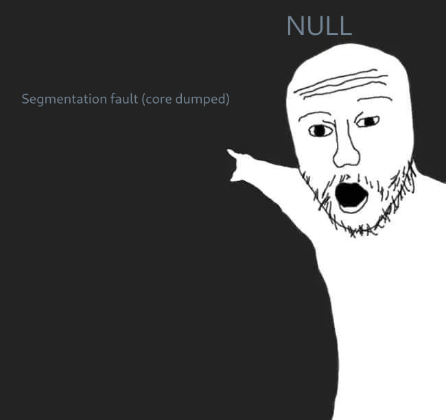

# Types du langage C

En C, il y a trois grandes familles de type : 

- Les nombres entiers `int`
- Les nombres à virgules (nombres flottant) `float`
- Les caractères `char`

# Codes de conversion 

::: columns
:::: column

| Lettre | Signification             |
| ------ | ------------------------- |
| `c`    | `char`                    |
| `d`    | `int`                     |
| `u`    | `unsigned int`            |
| `ld`   | `long`                    |
| `lu`   | `unsigned long`           |
| `f`    | `float` ou `double`       |
| `s`    | char par adresse (string) |

::::
:::: column



::::
:::

# Directives préprocesseurs

## `#Include`

Les `#include` permettent d'informer le compilateur d'ajouter des bibliothèques de fonctionnalités. Quelques exemples :

```c
#include <stdlib.h> // Librairie standard
#include <stdio.h>  // Librairie d'entrée sortie (printf / scanf) 
#include <math.h>   // Librairie des fonctions mathématiques
#include <string.h> // Librairie de gestion des strings
```

## `#define`

Les `#define` permettent de créer des macros

```c
# define LONGUEUR_RECTANGLE 4
# define LARGEUR_RECTANGE 2

int aire_du_rectange = LONGUEUR_RECTANGLE * LARGEUR_RECTANGLE
```

# Fonctions

Une fonction en C est un bloc de code composé de quelques instructions qui effectue une tâche spécifique.



# Fonctions

Prenons une fonction `doubleMe()` qui prend en entrée un entier et qui retourne son double.

## Déclaration de la fonction `doubleMe`

```c
int doubleMe(int x) {
    return x + x;
}
```

## Utilisation de `doubleMe`
```c
#include <stdio.h>

int main() {
    int x = doubleMe(6);
    printf("x = %d", x); // Affiche x = 12
    return 0;
}
```

# Tableaux

::: columns
:::: column

::::
:::: column
Un tableau est une collection séquencée de taille fixe d'éléments de données connexes et nous désignons cette collection d'éléments par un nom commun.

## Types de tableaux

Nous pouvons diviser les tableaux en 3 types.

- Tableau à une dimension
- Tableau à deux dimensions
- Tableau multidimensionnel
::::
:::

# Tableaux à une dimension

Voici la syntaxe d'un tableau unidimensionnel.

```c
type arrName [size] ;
```

Où, `type` est un type de données quelconque que nous voulons utiliser comme `int`, `float` etc. Et, `arrName` est le nom de la variable tableau.

Ensuite, nous avons les crochets qui contiennent une valeur entière `size` qui nous indique le nombre total de valeurs que nous pouvons stocker dans la variable tableau.

Les valeurs stockées dans un tableau sont appelées éléments du tableau.


# Tableaux à une dimension

Nous souhaitons stocker 20 notes de TP Maths et faire une moyenne dessus.

## Initialisons un tableau `t` de 20 valeurs entières. 

```c
int t[20];
```

On va le remplir de valeurs croissantes allant de 0 à 19 :

```c
for(int i = 0; i < 20; ++i) {
    t[i] = i;
}
```

# Tableaux

Une fois rempli, on va effectuer une moyenne dessus.

```c
int somme = 0; // Somme des notes du tableau
for(int i = 0; i < 20; ++i) {
     somme += t[i];
}

int moyenne = somme / 20;   
```

# Tableaux à deux dimensions.

Un tableau à deux dimensions est un tableau dans lequel chaque case contient un autre tableau. Graphiquement, on peut représenter cela par une grille.



# Pointeurs
::: columns

:::: column

En C, un pointeur est une adresse **pointant** vers un objet. A titre de comparaison, on peut associer le pointeur à une adresse postale et son objet par un lieu physique. L'adresse `41 Boulevard Vauban à Lille` pointe vers l'ISEN Lille !

| Adresse             | Objet       |
| ------------------- | ----------- |
| 41 Boulevard Vauban | ISEN        |
| `0x67826214`        | `int` : 114 |

## Usage 

Les pointeurs sont utiles pour modifier le contenu d'une variable sans la cloner ou la perdre.
::::

:::: column

{height=80%}

::::

:::

# Pointeurs
::: columns

:::: column

{height=80%}

::::

:::: column

{height=80%}

::::

:::

# Pointeurs

### Exemple 

Reprenons notre fonction `doubleMe()`, au lieu de créer une nouvelle variable en mémoire qui contient le double de la variable passée en argument, on va la modifier directement !

::: columns

:::: column

```c
void doubleMeEco(int* a) {
    *a = *a + *a;
}
```
::::

:::: column

```c
int a =  3;
doubleMeEco(&a); // Et on l'appelle avec 
```

::::

:::

Et pouf ! Plus de copie de variable.


### Application

Qu'est-ce qu'il se passe si on avait écrit ?

```c
void doubleMeEco(int a) {
    a = a + a;
}
```

Alors, rien. On copie a dans une variable temporaire et on la perd !

# Pointeurs

## Programme complet 
```c
#include <stdio.h>

void doubleMeEco(int* a) {
    *a = *a + *a;
}

int main()
{
    int a =  3;
    doubleMeEco(&a);
    printf("a = %d", a);

    return 0;
}
```

# Structure

Les structures sont un bloc de données. Elles ne peuvent contenir que des variables. On les définit comme ce qui suit :

```c
struct NomDeLaStructrure {
    int nombre;
    int* pointeur;
    // Vous mettez ce que vous souhaitez dedans
};
```

## Exemple de structure 

```c
typedef struct Map
{
    char* name[255]; // Name of the map
    char* author[255]; // Author of the map
    Frame* map[255];
} Map ;
```

# Structure

## Simplification d'écriture

Pour simplifier la déclaration d'une structure, on peut rajouter un typedef devant :

```c
typedef struct machin {
    // Données
} machin;
```


Cela permet d'écrire lorsqu'on souhaite déclarer un objet machin d'écrire :


```c
machin a; // Variable a de type machin
// au lieu
struct machin a // Variable a de type Structure machin
```

# Structure

## Accéder aux données d'une structure

Pour accéder au données d'une structure, on peut tout simplement faire : 

```c
tmp->nb_items = 0;
```

# Exercices 

## 1 - Résolution d'une équation du second degré

Écrire un programme qui permet d'entrer les coefficients $a$, $b$ et $c$ de l'équation : $$ax^2 + bx + c = 0$$ et affiche les solutions si elles existent.

# Exercices 

## 1 - Résolution d'une équation du second degré (Correction)

::: columns
:::: column

```c
#include <stdio.h>
#include <math.h>

int main (void) {
    int a, b, c;
    printf("Entrez trois nombres : ");
    scanf("%d %d %d", &a, &b, &c);
    // Calcul du discriminant delta
    int delta = (b * b) - (4 * a * c);
```
::::
:::: column
```c
    // Si delta est négatif, 
    // on affiche "pas de solution"
    if (delta < 0) {
        printf("Pas de solution\n");
        return 0;
    }

    // Si delta est nul, 
    // on affiche "une solution"
    else if (delta == 0) {
        printf("Une solution : x = %d\n", 
            (-b / (2 * a)));
        return 0;
    }
```
::::
:::

# Exercices 

## 1 - Résolution d'une équation du second degré (Correction suite)
```c
    // Calcul de x1 et x2
    float x1 = (-b + sqrt(delta)) / (2 * a);
    float x2 = (-b - sqrt(delta)) / (2 * a);
    // Affichage des solutions
    printf("x1 = %2.f\nx2 = %2.f\n", x1, x2);
    return 0;
}
```

### Sortie

```bash
Entrez trois nombres : 4 5 1
x1 = -0
x2 = -1
```

# Exercices

## 2 - Fonction récursive

Donner le code d'une fonction qui décompte jusqu'à 0 de manière récursive à partir d'une valeur initiale `compteur` passée en paramètre.

```c
void recursCompteurDecrement(int compteur){

    return;
}
```
# Exercices 

## 2 - Fonction récursive (Correction) 

```c
#include <stdio.h>

void recursCompteurDecrement(int compteur){
    if(compteur > 0){
        printf("%d\n", compteur);
        recursCompteurDecrement(compteur - 1);
    }
    return;
}

int main (void) {
    int compteur = 10;
    recursCompteurDecrement(compteur);
    return 0;
}
```

# Exercices

## 3 - Tableau à deux dimensions

- Initialiser un tableau de $10$ lignes et $10$ colonnes avec des valeurs entières $x \in [0,20]$
- Afficher le tableau
- Remplir un second tableau de même dimensions avec les valeurs du premier tableau en créant une symétrie par rapport à une diagonale
- Afficher le deuxième tableau

# Exercices

## 3 - Tableau à deux dimensions (`header.h`)

```c
#include <stdlib.h>
#include <stdio.h>

#define TAILLE 10

// Initialisation tableau deux dimensions de taille n*m
void init_tab(int tab[][TAILLE], int n, int m);

// Affichage tableau deux dimensions de taille n*m
void affiche_tab(int tab[][TAILLE], int n, int m);

// Copie symétrie tableau deux dimensions de taille n*m
void sym_tab(int tab[][TAILLE], int tab_deux[][TAILLE], int n, int m);
```

# Exercices

## 3 - Tableau à deux dimensions (`header.c`)


```c
#include "header.h"

// Initialisation tableau deux dimensions
void init_tab(int tab[][TAILLE], int n, int m)
{
    int i, j;
    for (i = 0; i < n; i++)
    {
        for (j = 0; j < m; j++)
        {
            tab[i][j] = rand() % 20;
        }
    }
}
```


# Exercices

## 3 - Tableau à deux dimensions (`header.c`)

```c
// Affichage d'un tableau
void affiche_tab(int tab[][TAILLE], int n, int m) {
    int i, j;
    for (i = 0; i < n; i++)
    {
        for (j = 0; j < m; j++)
        {
            printf("%d ", tab[i][j]);
        }
        printf("\n");
    }
}
```

# Exercices

## 3 - Tableau à deux dimensions (`header.c`)

```c
// Copie symétrie tableau deux dimensions de taille n*m
void sym_tab(int tab[][TAILLE], int tab_deux[][TAILLE], int n, int m) {
    int i, j;
    for (i = 0; i < n; i++)
    {
        for (j = 0; j < m; j++)
        {
            tab_deux[i][j] = tab[j][i];
        }
    }

}
```

# Exercices

## 3 - Tableau à deux dimensions (`main.c`)

```c
# include "header.h"

int main (void) {
    int tab[TAILLE][TAILLE];
    int tab_sym[TAILLE][TAILLE];

    init_tab(tab, TAILLE, TAILLE);

    // Affichage
    affiche_tab(tab, TAILLE, TAILLE);
    puts("");
    // Copie symétrique
    sym_tab(tab, tab_sym, TAILLE, TAILLE);
    affiche_tab(tab_sym, TAILLE, TAILLE);
    return 0;
}
```


# Mini Projet

## Les listes chainées
Une liste chainée permet de ranger plus facilement des données que dans un tableau. Chaque Maillon contient une valeur et l'adresse en mémoire du
maillon suivant.

Dans ce cas, les emplacements des différents éléments peuvent être alloués de manière dynamique, au fur et à mesure des besoins. Il n'est pas nécessaire de connaître d'avance le nombre d'éléments ou une valeur/plafond maximal.

### Questions 

- Créer une structure noeud (contenant une valeur et un pointeur vers le maillon suivant)
- Créer une structure liste (contenant l'adresse du premier/dernier élément et sa longueur)
- Une fonction de création de noeud dont voici le prototype : 
```c
Node* createNode(int initialData)
```
- Une fonction de création de liste
- Une fonction d'ajout d'un noeud à une liste
- Une fonction d'affichage de la liste
- Une fonction de suppression d'un maillon/noeud
